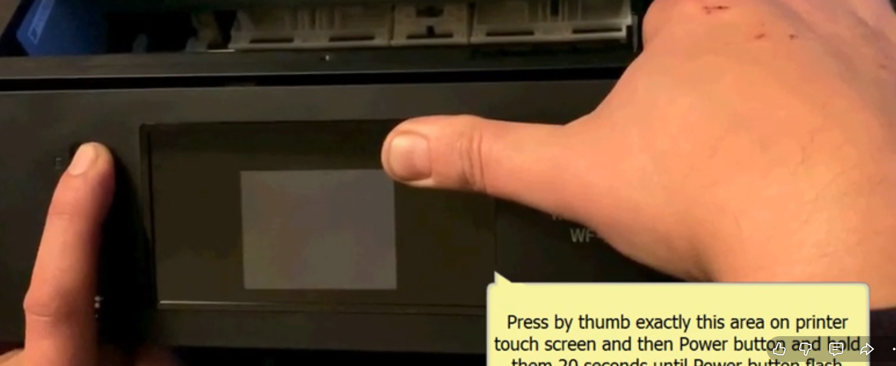
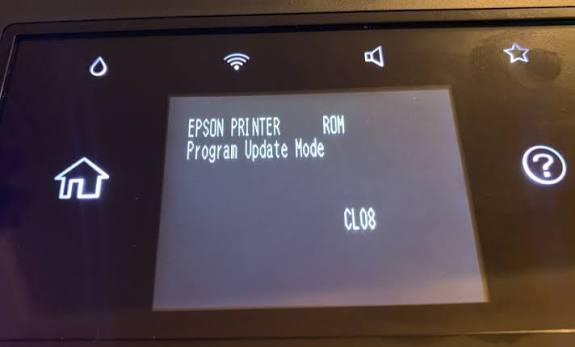

# Epson Firmware Rollback Guide

A guide to rolling back Epson printer firmware to a previous version, undoing recent updates that block third-party and refilled ink cartridges from working.

This guide was written for the **Epson WorkForce WF-3820**, but it should work for other WorkForce models and possibly other Epson printers as well. The general steps will be the same — the main differences will be the firmware file and updater tool you need for your specific model.

Throughout this guide I've linked YouTube videos that helped me downgrade my own printer's firmware, along with a site I used to find additional firmware versions.

> ⚠️ **Disclaimer:** Flashing firmware always carries some risk of bricking your printer. Follow the steps carefully, don't unplug/interrupt the process, and proceed at your own risk. I am not responsible for any damage to your device.

---

## What You'll Need

- An Epson WorkForce WF-3820 (or similar model)
- A PC or laptop
- A USB Type-A to Type-B cable (standard "printer cable")
- The firmware file below
- The Epson Software Updater tool

---

## Step 1: Download the Firmware Files

You'll need firmware version **SI13LC**. This is the version that fixed the 3rd-party cartridge issue for me.

> ⚠️ **Note:** Any firmware older than SI13LC will give you a scanner error. Stick with this version unless you know what you're doing.

These are Epson's own official files — I've made them easier to find by hosting them here instead of you having to dig around the internet for them.

📁 **Firmware file:** `FWCJ07TL_SI13LC.exe` — [see Releases](https://github.com/iamGaven/epson-firmware-downgrade-guide/releases/tag/v1) 

If your printer isn't a WF-3820, or you need a different firmware version, you can find more firmware files for other Epson WorkForce models here:

🔗 [https://www.helpdrivers.com/multifunctions/Epson/WorkForce_Series/WorkForce_WF-3820_All-in-One/](https://www.helpdrivers.com/multifunctions/Epson/WorkForce_Series/WorkForce_WF-3820_All-in-One/)

---

## Step 2: Put Your Printer Into Update Mode

Before you can flash the firmware, you need to put the printer into **Update Mode** (not Recovery Mode — see the warning below).

**To enter Update Mode:**

1. Cover the top-right corner of the LCD touchscreen with your finger.
2. While still covering it, hold the **Power** button for about 20 seconds.
3. As soon as you see the power light come on, **let go right away**.

> ⚠️ **Important:** Holding the power button too long will put the printer into **Recovery Mode**, not Update Mode. You want Update Mode, so let go as soon as the power light comes on.

🎥 **Video walkthrough:** [How to enter Update Mode](https://www.youtube.com/watch?v=eW9sdQO9NRU)

Once you're in Update Mode, your printer's screen should look like this:

---

## Step 3: Connect Your Printer to Your Computer

Plug your printer into your PC or laptop using a **USB Type-A to Type-B cable** (the standard cable used for printers).

---

## Step 4: Run the Firmware Updater

1. Run the firmware file you downloaded in Step 1: `FWCJ07TL_SI13LC.exe`
2. Follow the on-screen prompts to complete the downgrade.

🎥 **Video walkthrough:** [How to use the firmware updater](https://www.youtube.com/watch?v=qmuLRAWUcgs)

---

## Step 5: Disable Firmware Update Notifications

Once the firmware downgrade is complete, you'll want to stop the printer from prompting you to update again (which would re-break the 3rd-party cartridge fix).

1. On your printer, go to **Settings > Firmware Settings**.
2. Turn **off** firmware notifications.

---

## Step 6: Disable Software Update Checks on Your PC

Next, run the **Epson Software Updater** (`ESU_502.exe`, version 5.02) and disable automatic software checks so it doesn't try to push the firmware update back onto your printer.

1. Open `ESU_502.exe`.
2. Set software checks to **Never**.

You can download the Epson Software Updater from the official support page for the WF-3820:

🔗 [Epson WorkForce Pro WF-3820 Support Page](https://epson.com/Support/Printers/All-In-Ones/WorkForce-Series/Epson-WorkForce-Pro-WF-3820/s/SPT_C11CJ07201?review-filter=Windows+10+64-bit#panel-drivers-6-1)

🎥 **Video walkthrough:** [How to disable update checks](https://www.youtube.com/watch?v=nQlGFXwG1WE)

---

## Done!

At this point your printer should be running the older firmware and no longer blocking third-party or refilled cartridges, and it should stop nagging you to update.

---

## Finding Firmware for Other Models

If you have a different WorkForce (or other Epson) model, you can search for the matching firmware version here:

🔗 [helpdrivers.com — Epson WorkForce Series](https://www.helpdrivers.com/multifunctions/Epson/WorkForce_Series/WorkForce_WF-3820_All-in-One/)

---

## Credits

Thanks to the creators of the linked YouTube videos, whose walkthroughs made this process much easier to follow.
